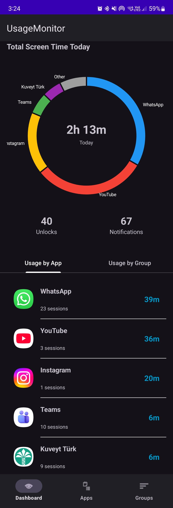
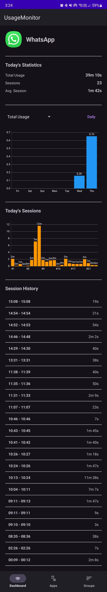
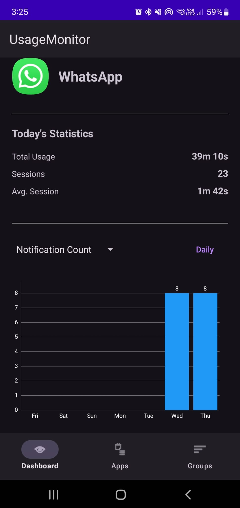
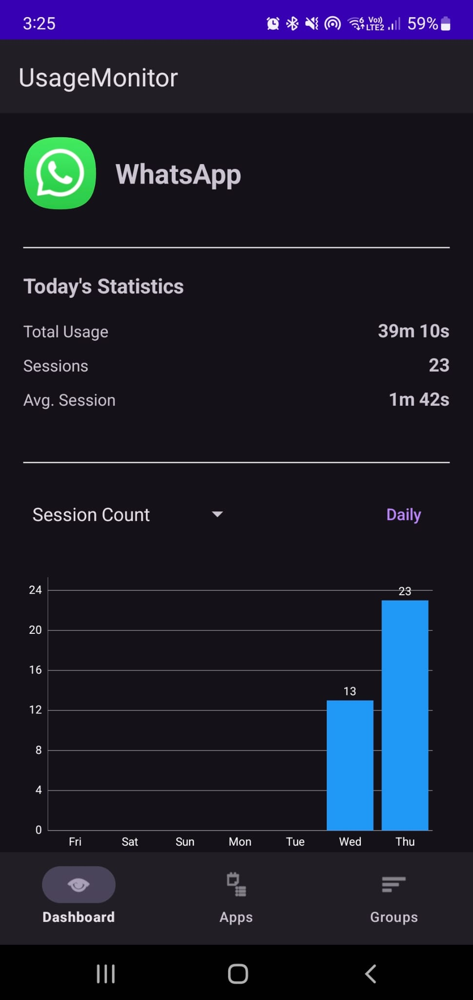
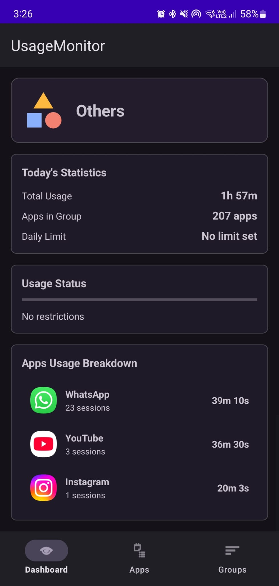
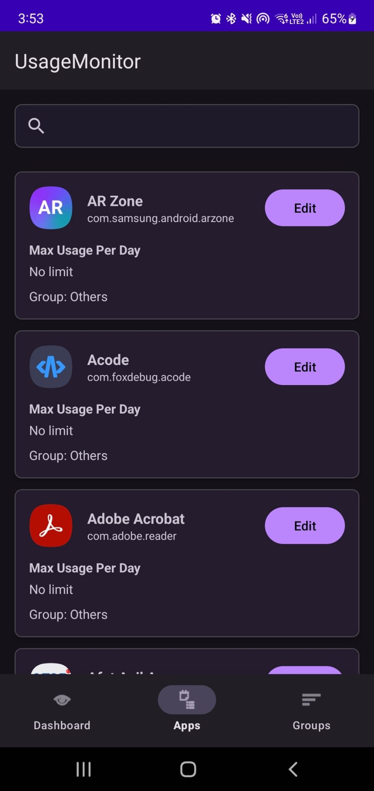
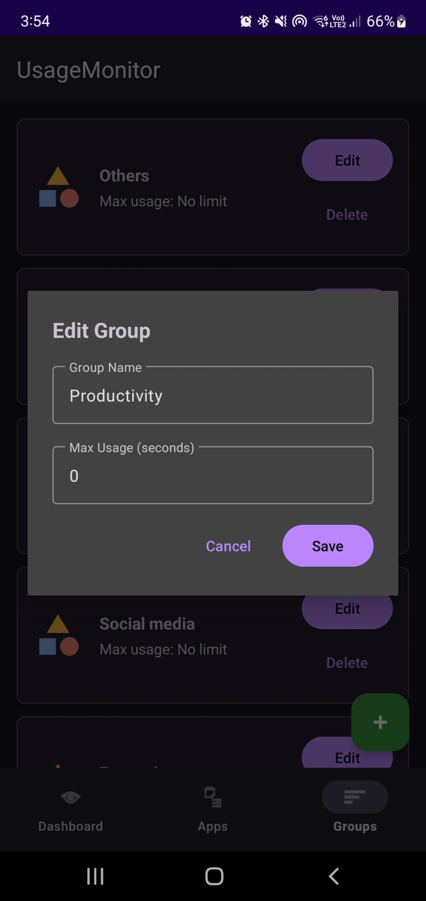
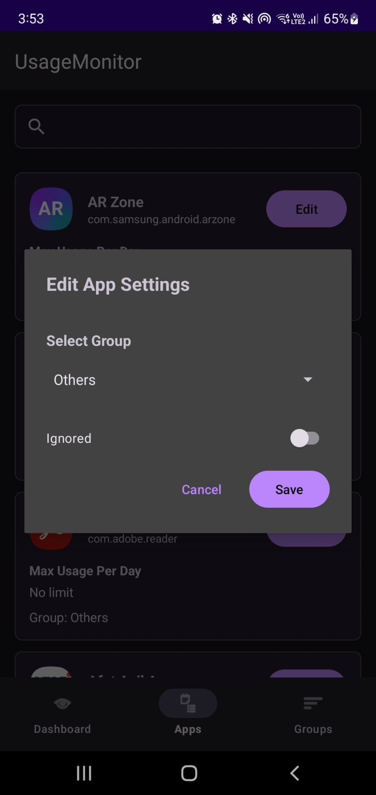

# Usage Monitor

An Android application for monitoring and managing app usage, tracking screen time, notifications.

## 📱 Features

- **Dashboard Overview**: Get a comprehensive view of your device usage statistics
- **App Usage Tracking**: Monitor individual app usage time and sessions
- **Notification Tracking**: Track notifications received from each app
- **App Groups**: Organize apps into custom groups for better management
- **Usage Sessions**: View detailed session history for each app
- **Real-time Monitoring**: Background service tracks usage in real-time

## 🖼️ Screenshots

### Dashboard
The main dashboard provides an overview of your daily usage statistics.



### App Details - Total Usage
View detailed usage statistics for individual apps, including total time spent.



### App Details - Notifications
Track the number of notifications received from each app.



### App Details - Sessions
View all usage sessions for a specific app with timestamps.



### Group Details
Monitor usage statistics for app groups you've created.



### Apps List
Browse all installed apps and their usage statistics.



### Edit Groups
Create and manage app groups to organize your apps.



### Groups Overview
View all your created app groups.


### Edit App Settings
Customize settings and limits for individual apps.



## 🛠️ Technical Details

### Built With

- **Language**: Kotlin
- **Minimum SDK**: API 23 (Android 6.0)
- **Target SDK**: API 36
- **Architecture Components**:
  - Room Database for local data persistence
  - Android Services for background monitoring
  - Fragments for modular UI
  - Material Design Components

### Permissions Required

- `PACKAGE_USAGE_STATS`: To access app usage statistics
- `GET_TASKS`: To monitor running apps
- `QUERY_ALL_PACKAGES`: To query installed apps
- `FOREGROUND_SERVICE`: For background monitoring service
- `FOREGROUND_SERVICE_DATA_SYNC`: For data synchronization
- `POST_NOTIFICATIONS`: To display usage notifications
- `BIND_NOTIFICATION_LISTENER_SERVICE`: To track apps notifications

### Key Components

- **AppsUsageManager**: Core manager for tracking app usage
- **UsageMonitorService**: Background service for real-time monitoring
- **NotificationListenerService**: Tracks app notifications
- **UsageDatabase**: Room database for storing usage data
- **Fragments**:
  - `DashboardFragment`: Main overview screen
  - `AppsFragment`: List of all apps
  - `AppDetailFragment`: Individual app details
  - `GroupsFragment`: App groups management
  - `GroupDetailFragment`: Group statistics
  - `ChallengesFragment`: Usage challenges

## 🚀 Getting Started

### Prerequisites

- Android Studio (latest version recommended)
- JDK 11 or higher
- Android SDK with API 36

### Installation

1. Clone the repository:
   ```bash
   git clone https://github.com/yourusername/UsageMonitor.git
   ```

2. Open the project in Android Studio

3. Sync Gradle files

4. Build and run the project on your device or emulator

### First Launch

1. Grant Usage Access permission when prompted
2. Enable Notification Listener access in settings
3. The app will start tracking your usage automatically

## 📊 How It Works

1. **Background Monitoring**: The `UsageMonitorService` runs in the background to track app usage in real-time
2. **Data Collection**: Usage data, sessions, and notifications are stored in a local Room database
3. **Statistics Calculation**: The app calculates daily, weekly, and custom period statistics
4. **Notification Tracking**: The notification listener service captures all app notifications
5. **Challenges**: Set up challenges to limit your usage and get notified when limits are reached

## 🔒 Privacy

All usage data is stored locally on your device. The app does not collect or transmit any personal information or usage statistics to external servers.

## 📝 License

This project is licensed under the MIT License - see the LICENSE file for details.

## 👥 Contributors

- Abdalrahman Nasr

## 🤝 Contributing

Contributions, issues, and feature requests are welcome!

## 📧 Contact

For questions or support, please open an issue in the repository.

---

**Note**: This app requires Android 6.0 (API 23) or higher to function properly.

